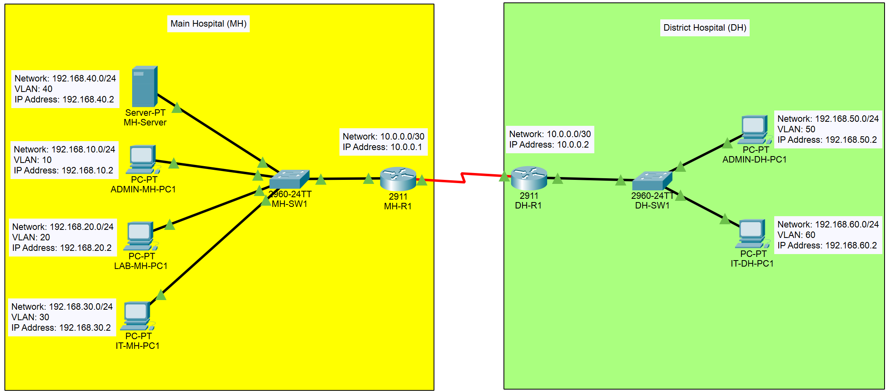
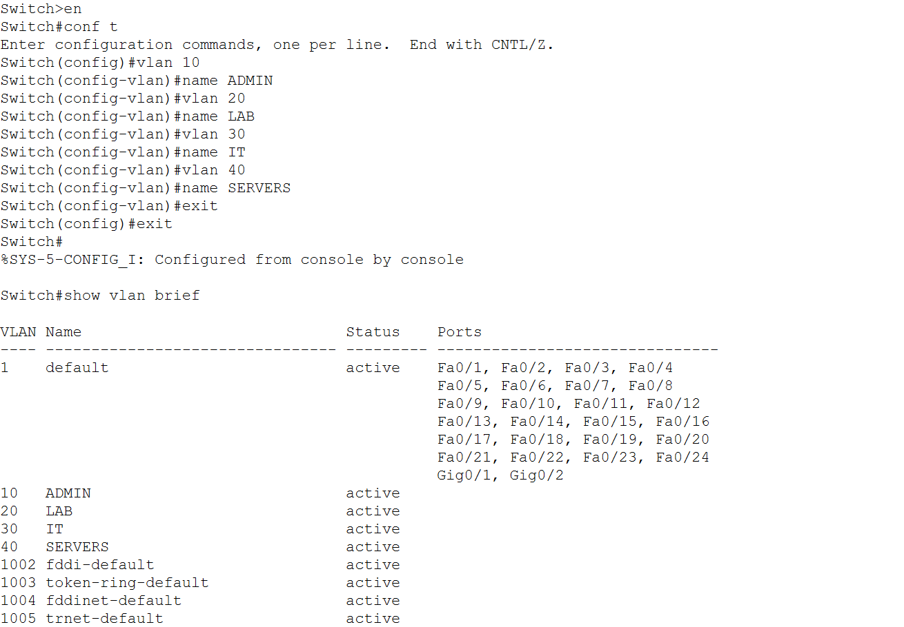
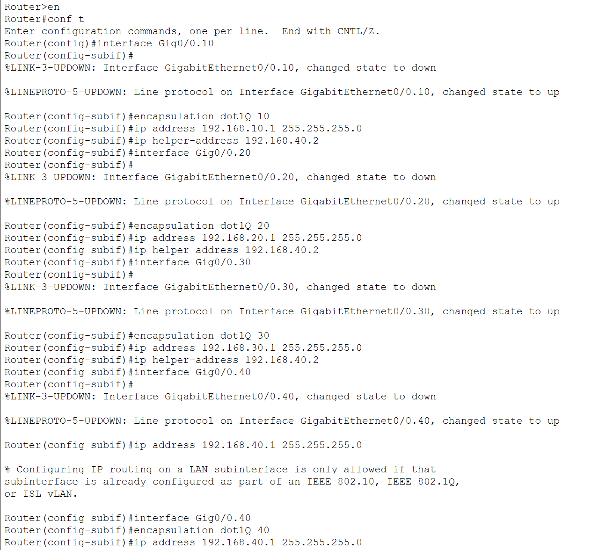
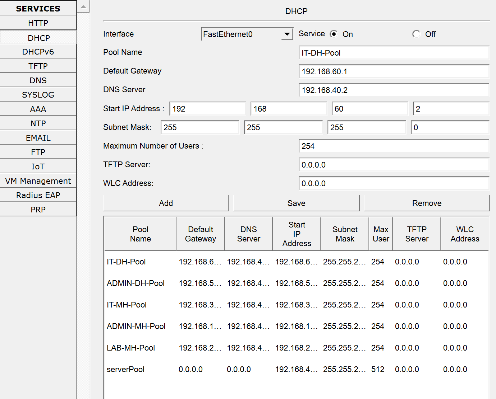
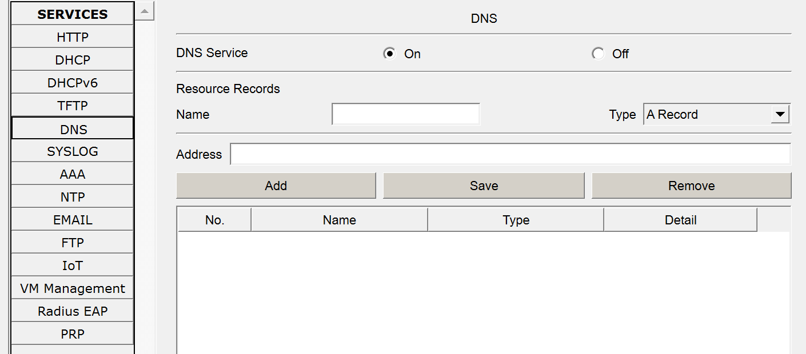
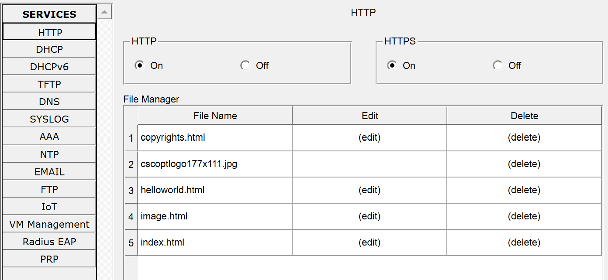
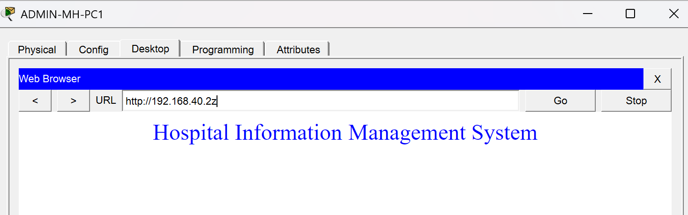
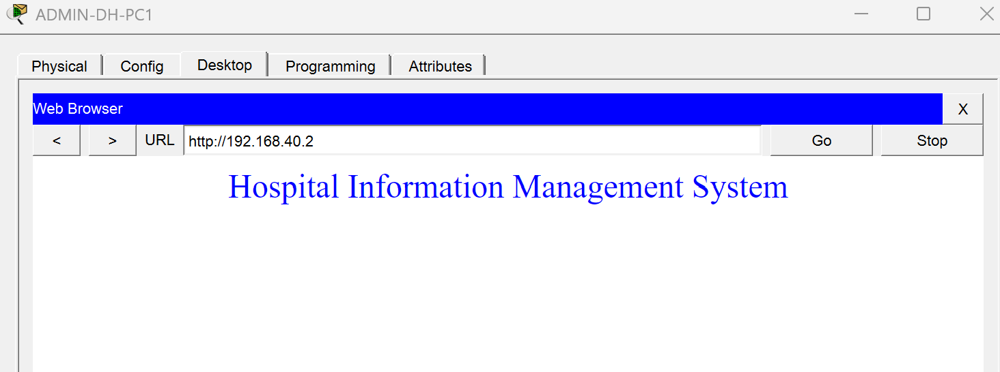

# Hospital Multi-Site Network

## Description

Designed and implemented a multi-site hospital network connecting a Main Hospital and a District Hospital through a WAN link. The network provides departmental segmentation using VLANs, dynamic routing with OSPF, and centralized network services hosted at the Main Hospital Server.

## Objectives

- Design a multi-site network infrastructure
- Implement VLAN-based network segmentation
- Configure inter-VLAN routing using Router-on-a-Stick
- Deploy OSPF for dynamic route exchange
- Centralize network services using a dedicated server
- Provide automated IP address management through DHCP
- Enable communication between hospital sites

## Network Topology

## Devices Used

| Device Type | Quantity |
|------------|----------|
| Router 2911 | 2 |
| Switch 2960 | 2 |
| Server | 1 |
| PCs | 5 |

## Port Assignments

### Main Hospital Switch

| Interface | Connected Device |
|------------|------------------|
| Fa0/1 | ADMIN-MH-PC1 |
| Fa0/2 | LAB-MH-PC1 |
| Fa0/3 | IT-PC1 |
| Fa0/4 | MH-Server |
| G0/1| MH-R1 |

### District Hospital Switch

| Interface | Connected Device |
|------------|------------------|
| Fa0/1 | ADMIN-PC1 |
| Fa0/2 | IT-PC1 |
| G0/1 | DH-R1 |

## Vlan Design

| VLAN ID | Department | Network |
|----------|------------|----------|
| 10 | Admin (Main)| 192.168.10.0/24 |
| 20 | Laboratory | 192.168.20.0/24 |
| 30 | IT (Main) | 192.168.30.0/24 |
| 40 | Servers | 192.168.40.0/24 |
| 50 | Admin (District) | 192.168.50.0/24 |
| 60 | IT (District) | 192.168.60.0/24 |

## IP Addressing Scheme

| Device | IP Address |
|----------|----------|
| MH-Server | 192.168.40.2 |
| VLAN 10 Gateway | 192.168.10.1 |
| VLAN 20 Gateway | 192.168.20.1 |
| VLAN 30 Gateway | 192.168.30.1 |
| VLAN 40 Gateway | 192.168.40.1 |
| VLAN 50 Gateway | 192.168.50.1 |
| VLAN 60 Gateway | 192.168.60.1 |

## WAN Addressing

| Device | Interface | IP Address |
|----------|----------|----------|
| PH-R1 | Se0/0/0 | 10.0.0.1/30 |
| DH-R1 | Se0/0/0 | 10.0.0.2/30 |

### Server Services Hosted
- DHCP
- DNS
- HTTP

## Configurations

### VLAN Configuration

Configuration:

- Created dedicated VLANs for hospital departments
- Implemented VLAN segmentation at both sites
- Assigned switch access ports to corresponding VLANs
- Configured trunk links between switches and routers

Main Hospital Switch

District Hospital Switch

### Inter-VLAN Routing & DHCP Relay

Configuration:

- Implemented Router-on-a-Stick architecture
- Configured router subinterfaces for each VLAN
- Assigned gateway addresses to departmental networks
- Enabled communication between VLANs
- Configured DHCP relay using IP Helper Addresses

Main Hospital Router

District Hospital Router

### OSPF Config

Configuration:

- Established OSPF neighbor relationships between hospital sites
- Advertised all local networks through OSPF
- Enabled automatic route learning across the WAN connection
  
Main Hospital Router

District Hospital Router

### DHCP Services

Configuration:

- Deployed centralized DHCP services on the Provincial Hospital server
- Created DHCP pools for all departmental VLANs
- Enabled automatic IP address assignment across both hospital sites

DHCP Configuration

### DNS Services

Configuration:

- Configured centralized DNS services
- Implemented internal hostname resolution
- Enabled access to centralized services using DNS records

DNS Configuration

### HTTP Services

Configuration:

- Enabled HTTP services on the centralized server
- Deployed a web-based hospital intranet page
- Verified accessibility from both hospital locations

HTTP Configuration

Test Connection at Main Hospital

Test Connection at DistrictHospital

## Results

- Successfully connected Provincial and District Hospital networks
- Implemented secure departmental network segmentation
- Established dynamic routing using OSPF
- Centralized DHCP, DNS, and HTTP services
- Enabled communication across multiple hospital sites

## Skills Demonstrated

- VLAN Configuration
- Switch Administration
- Trunk Configuration
- OSPF Dynamic Routing
- DHCP Administration
- DHCP Relay Configuration
- DNS Services
- Web Server Deployment
- WAN Connectivity
