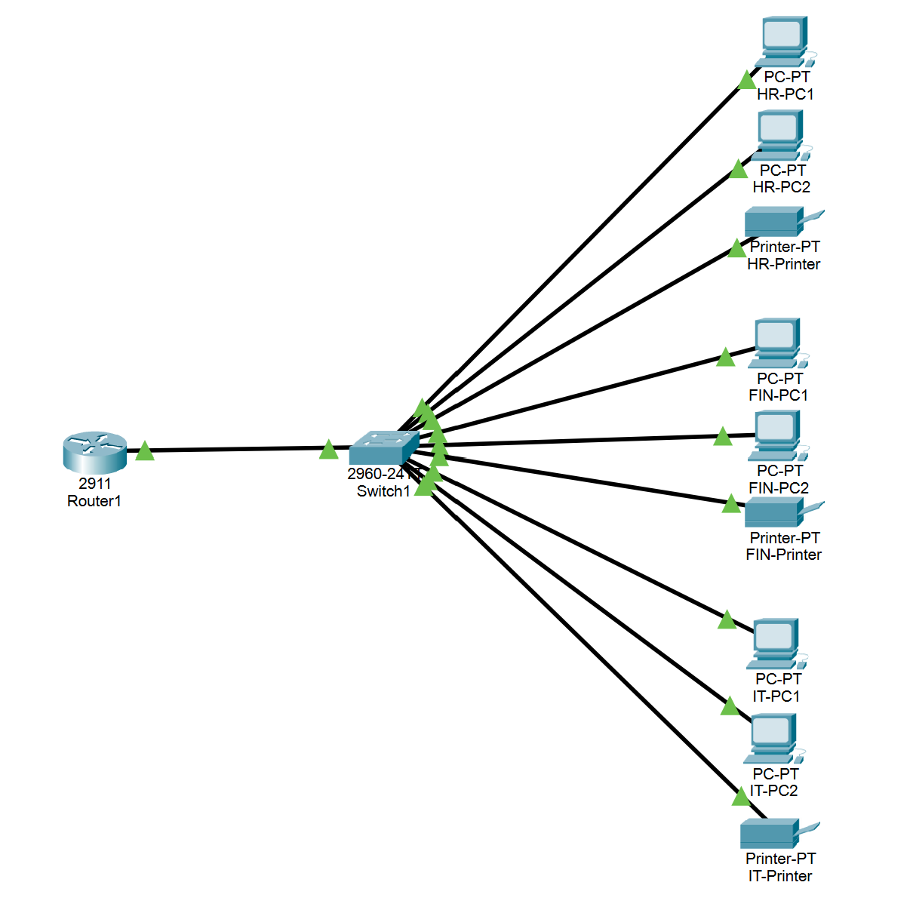
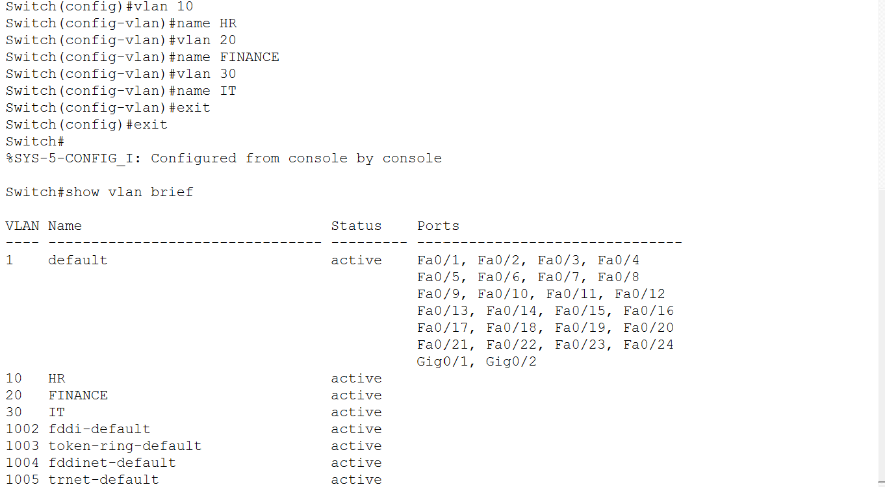
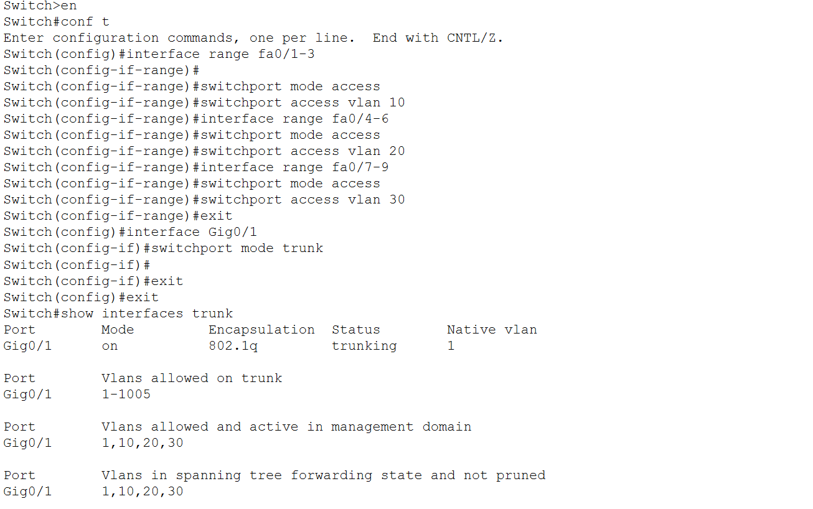
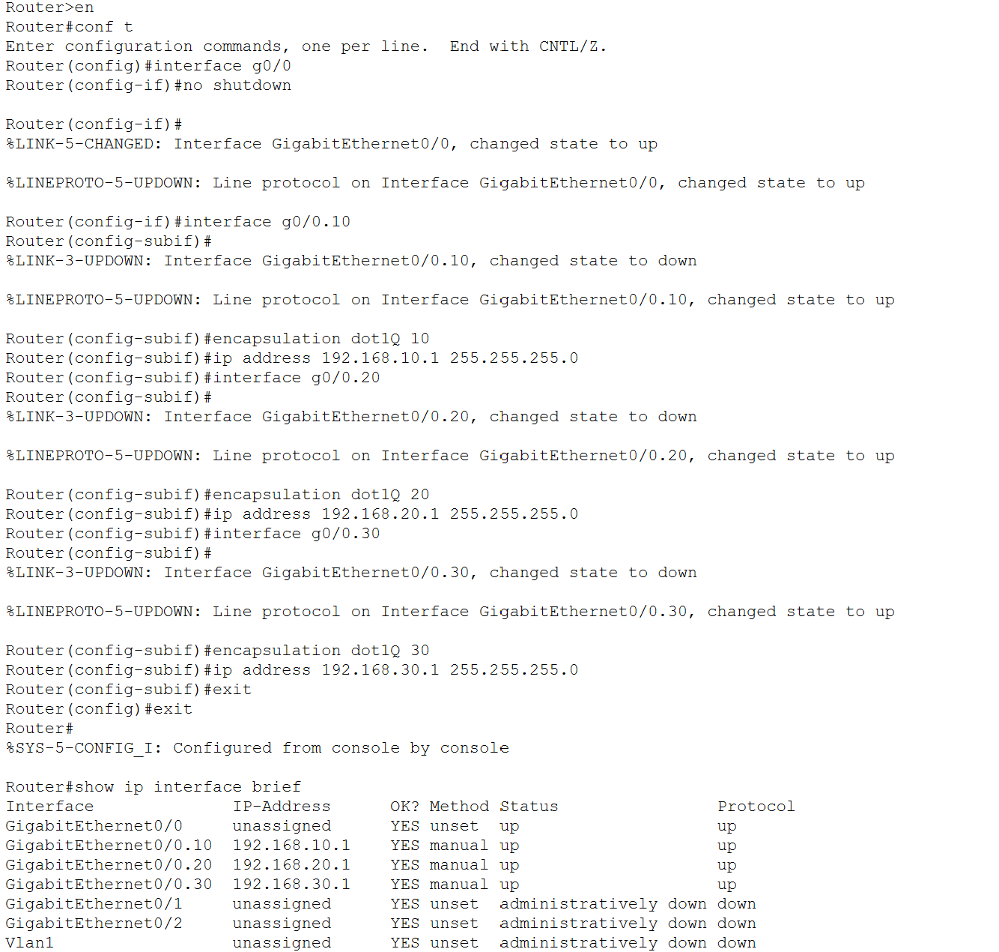
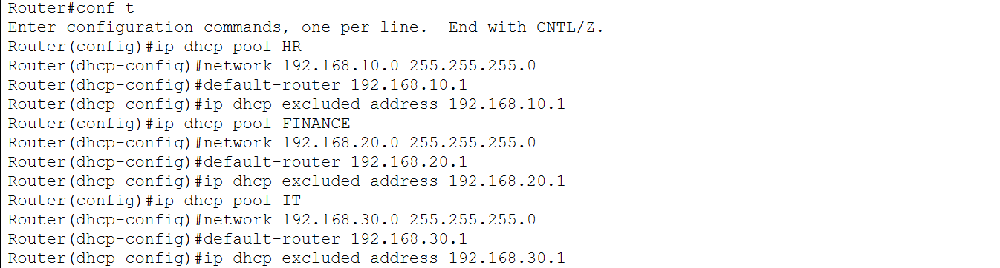

# Small Office Network

## Description

Designed and implemented a segmented office network for a small business using VLANs, inter-VLAN routing, and DHCP services. The network separates departments into dedicated VLANs while allowing communication between them through a router.

## Objectives

- Implement VLAN-based network segmentation
- Configure inter-VLAN routing using Router-on-a-Stick
- Provide automatic IP address assignment through DHCP
- Support shared network resources such as printers

## Network Topology

## Port Assignments

| Device | Interface | Connected To |
|----------|----------|-------------|
| Router1 | G0/0 | Switch1 G0/1 |
| Switch1 | Fa0/1 | HR-PC1 |
| Switch1 | Fa0/2 | HR-PC2 |
| Switch1 | Fa0/3 | HR-Printer |
| Switch1 | Fa0/4 | FIN-PC1 |
| Switch1 | Fa0/5 | FIN-PC2 |
| Switch1 | Fa0/6 | FIN-Printer |
| Switch1 | Fa0/7 | IT-PC1 |
| Switch1 | Fa0/8 | IT-PC2 |
| Switch1 | Fa0/9 | IT-Printer |
| Switch1 | Fa0/24 | Router1 G0/0 |

## Devices Used

| Device Type | Quantity |
|------------|----------|
| Router 2911 | 1 |
| Switch 2960 | 1 |
| PCs | 6 |
| Printers | 3 |

## VLAN Design

| VLAN ID | Department | Network |
|----------|------------|----------|
| 10 | HR | 192.168.10.0/24 |
| 20 | Finance | 192.168.20.0/24 |
| 30 | IT | 192.168.30.0/24 |

## IP Addressing Scheme

| Device | IP Address |
|----------|----------|
| VLAN 10 Gateway | 192.168.10.1 |
| VLAN 20 Gateway | 192.168.20.1 |
| VLAN 30 Gateway | 192.168.30.1 |
| HR Printer | 192.168.10.11 |
| Finance Printer | 192.168.20.11 |
| IT Printer | 192.168.30.11 |

## Configurations 

### VLAN Configuration

Configuration:

- Created separate VLANs for HR, Finance, and IT departments
- Assigned switch access ports to their corresponding VLANs
- Configured a trunk link between the switch and router

### Inter-VLAN Routing

Configuration:

- Implemented Router-on-a-Stick using router subinterfaces
- Assigned gateway addresses for each VLAN
- Enabled communication between departmental networks

### DHCP Services

Configuration:

- Created DHCP pools for each VLAN
- Configured automatic IP address allocation for client devices
- Defined default gateways for each subnet
- Reserved infrastructure addresses from DHCP assignment

## Results

- Successfully segmented departmental traffic using VLANs
- Enabled inter-department communication through routing
- Automated client IP address management using DHCP
- Integrated shared printing resources into the network
- Established a scalable and organized network infrastructure

## Skills Demonstrated

- VLAN Configuration
- Switch Administration
- Inter-VLAN Routing
- DHCP Configuration
- IP Address Planning
